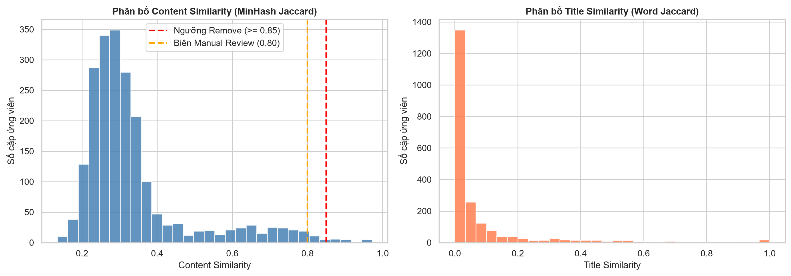
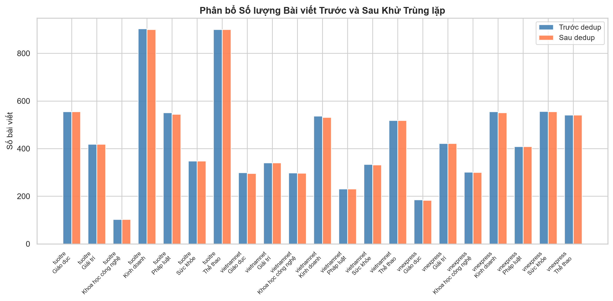
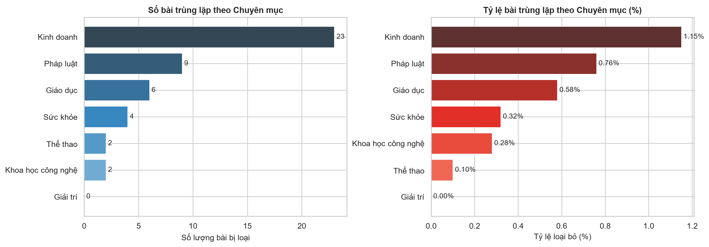
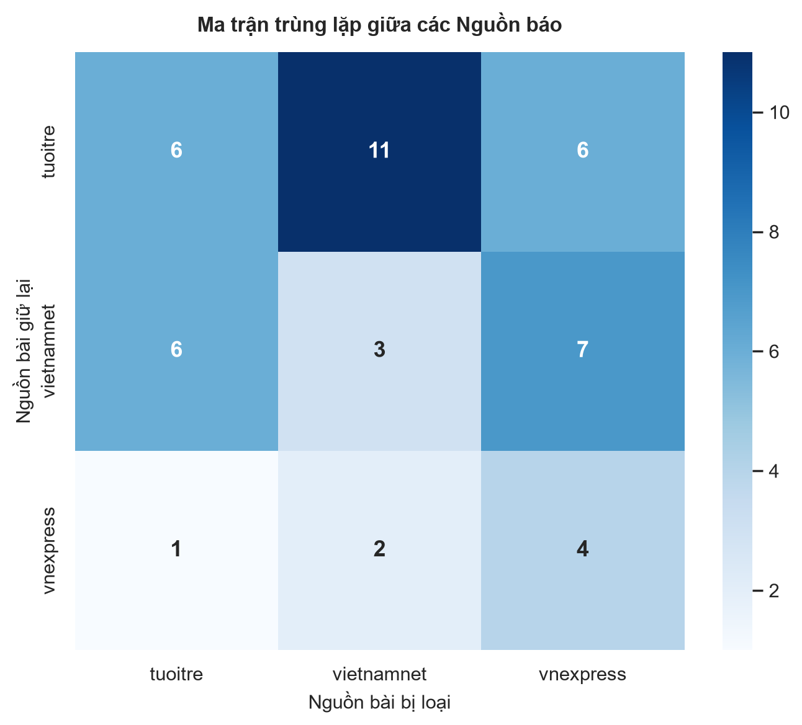

# Chính sách khử trùng lặp (Deduplication Policy)

## 1. Tổng quan

Pipeline khử trùng lặp 2 tầng được áp dụng trên tập dữ liệu `data/interim/news_articles_validated.csv` (9,304 bài viết).

| Chỉ số | Giá trị |
|---|---|
| Tổng bài trước dedup | 9,304 |
| Tổng bài sau dedup | 9,274 |
| Exact duplicate loại bỏ | 0 |
| Near duplicate loại bỏ | 30 |
| **Tổng loại bỏ** | **30** |
| **Tỷ lệ loại bỏ** | **0.32%** |
| Candidate pairs (near-dup) | 2,122 |

## 2. Tầng 1: Exact Duplicate

### 2.1 Chuẩn hóa văn bản & URL
- Unicode NFC, lowercase, loại bỏ toàn bộ dấu câu, gộp khoảng trắng thừa.
- URL: Bỏ scheme (http/https), tiền tố `www.`, các tham số theo dõi (query params) và dấu gạch chéo cuối.

### 2.2 Hai khóa so sánh tuần tự
1. `exact_url`: Trùng URL sau chuẩn hóa.
2. `exact_content`: Trùng SHA-256 hash của nội dung chuẩn hóa.

## 3. Tầng 2: Near Duplicate

### 3.1 Sinh cặp ứng viên 
- MinHash LSH (`datasketch`, threshold 0.70, 128 permutations) kết hợp **Title Blocking** (toàn bộ các bài có cùng tiêu đề chuẩn hóa).
- Tổng số cặp ứng viên: 2,122 cặp.

### 3.2 Xác thực chính xác
- `title_similarity`: Exact Word Jaccard trên tập từ vựng tiêu đề.
- `content_similarity`: **Exact Word Jaccard** trên tập từ vựng nội dung thực tế (loại bỏ hoàn toàn sai số ước lượng của MinHash).
- `days_diff`: Khoảng cách thời gian đăng bài (tính bằng ngày).
- `category_conflict`: Cờ phát hiện xung đột nhãn `category_gold` giữa 2 bài báo.

### 3.3 Ma trận quyết định
- `keep_both`:
  - Trùng hoặc giống tiêu đề nhưng đăng cách nhau > 2 ngày và nội dung khác biệt (`content_sim < 0.70`): Bảo tồn tin tức định kỳ (ví dụ 3 bài giá xăng các tuần).
  - `content_sim < 0.80`: Giữ cả hai để bảo tồn đa dạng ngữ liệu.
- `manual_review`:
  - `category_conflict == True`: Hai bài trùng lặp cao nhưng khác chuyên mục (ví dụ FPT Retail thuộc Sức khỏe vs Kinh doanh; Vietcombank thuộc Giáo dục vs Kinh doanh). Không tự ý xóa để bảo toàn nhãn ground truth cho pha đánh giá mô hình.
  - `0.80 <= content_sim < 0.85`: Vùng biên nhạy cảm.
- `remove`: `content_sim >= 0.85` HOẶC (`title_sim >= 0.60` VÀ `content_sim >= 0.70` VÀ `days_diff <= 2 ngày`) không có xung đột chuyên mục.

### 3.4 Transitive Closure với Union-Find
Các cặp bài có quyết định `remove` được gom cụm bằng cấu trúc Union-Find, mỗi cụm chỉ chọn 1 bài đại diện duy nhất theo Tie-breaking rule.

## 4. Thứ tự ưu tiên giữ bài
1. Ưu tiên 1: Bài có nội dung dài hơn (`len(content)`).
2. Ưu tiên 2: Bài có ngày đăng hợp lệ (`published_at`).
3. Ưu tiên 3: Bài có `article_id` nhỏ hơn (ổn định, tái lập được).
4. Tuyệt đối KHÔNG ưu tiên dựa trên nhãn `category_gold`.

## 5. Xử lý xung đột chuyên mục
Các trường hợp bài viết có nội dung trùng lặp cao nhưng mang nhãn `category_gold` khác nhau được nhận diện là tin bài đa chuyên mục (multi-label) và được chuyển sang `manual_review`, không tự động xóa để tránh thiên lệch nhãn đối sánh chuẩn.

## 6. Biểu đồ minh họa

### 6.1 Phân bố Similarity

### 6.2 Trước và Sau Dedup

### 6.3 Số lượng và Tỷ lệ Trùng lặp theo Chuyên mục

### 6.4 Ma trận Trùng lặp giữa các Nguồn Báo (Cross-Source)

