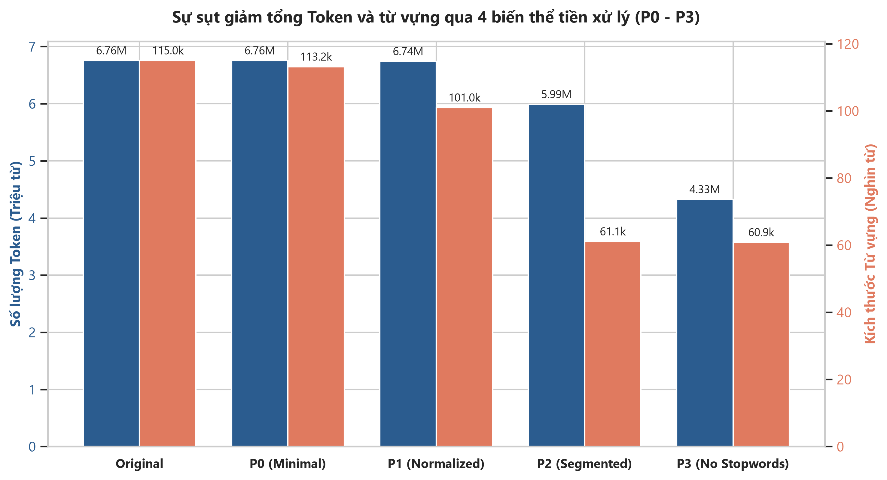
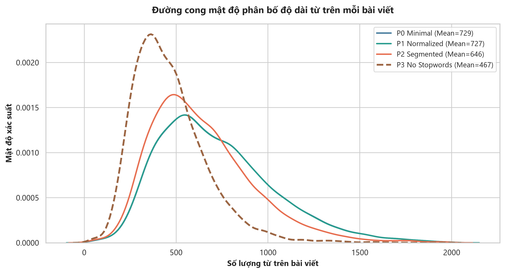
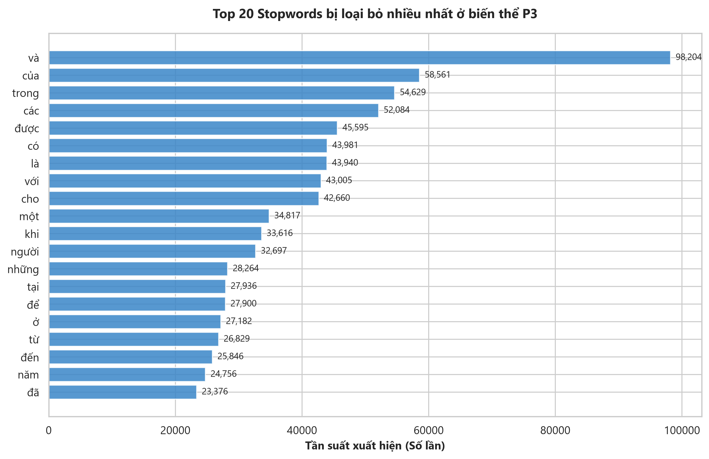
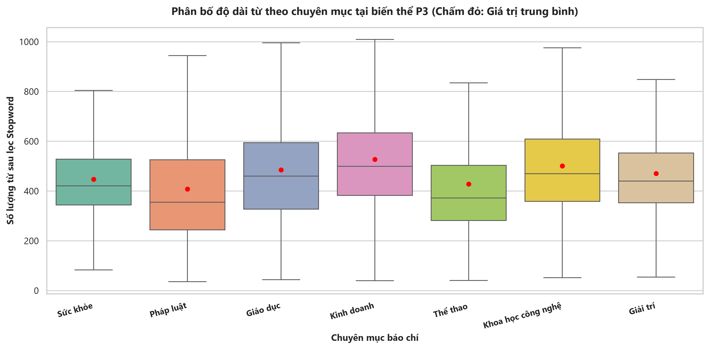
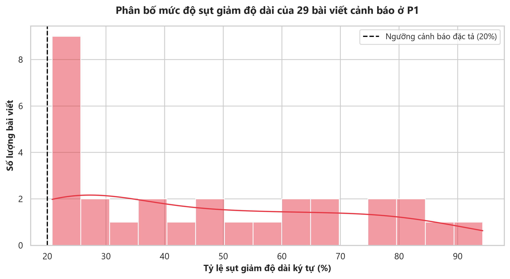

# Quy tắc tiền xử lý văn bản

Tài liệu quy định và lý giải toàn bộ quy tắc kỹ thuật áp dụng cho **Task D03: Xây dựng 4 biến thể tiền xử lý văn bản tiếng Việt (P0, P1, P2, P3)** trên tập dữ liệu sạch `data/interim/news_articles_deduplicated.csv`.

---

## 1. Tổng quan & Mục đích Thiết kế

Mục tiêu cốt lõi của Task D03 là phục vụ nghiên cứu bóc tách cho bài toán Khám phá chủ đề tin tức (Topic Discovery) với 5 mô hình NLP (K-Means, NMF, LDA, Top2Vec, BERTopic). Mỗi biến thể P0 $\rightarrow$ P3 được thiết kế có chủ đích cho các họ mô hình khác nhau:

| Biến thể | Tên gọi | Mục đích kỹ thuật | Họ mô hình đích sử dụng |
| :--- | :--- | :--- | :--- |
| **P0** | Minimal Cleaning | Làm sạch tối thiểu, bảo tồn trọn vẹn cú pháp tự nhiên | PhoBERT, Multilingual BERT, LLM, BERTopic |
| **P1** | Controlled Normalization | Chuẩn hóa, bóc tách nhiễu báo chí và boilerplate | Word Embeddings (Word2Vec, FastText), TF-IDF có kiểm soát |
| **P2** | Word Segmentation | Tách từ ghép tiếng Việt có nghĩa | Bag-of-Words (TF-IDF, K-Means, NMF, LDA) |
| **P3** | Stopword Removal | Lọc bỏ hư từ ngữ pháp, bảo toàn từ phủ định | Thực nghiệm bóc tách tác động của từ dừng đối với LDA / NMF |

### Bảng số liệu biến chuyển kết cấu qua 4 biến thể:

| Biến thể | Số bài viết | Tổng Token | Số từ TB/bài | Median | P5 | P95 | Kích thước từ vựng | Tỷ lệ giữ lại |
| :--- | :---: | :---: | :---: | :---: | :---: | :---: | :---: | :---: |
| **Original (Sau Dedup)** | 9,274 | 6,756,487 | 728.54 | 609.0 | 185.0 | 1,514.0 | 115,033 | 100.00% |
| **P0 (Minimal)** | 9,274 | 6,756,482 | 728.54 | 609.0 | 185.0 | 1,514.0 | 113,175 | 100.00% |
| **P1 (Normalized)** | 9,274 | 6,742,822 | 727.07 | 607.0 | 184.0 | 1,512.0 | 100,997 | 99.80% |
| **P2 (Segmented)** | 9,274 | 5,989,915 | 645.88 | 539.0 | 165.0 | 1,340.0 | 61,108 | 88.66% |
| **P3 (No Stopwords)** | 9,274 | 4,327,312 | 466.61 | 386.0 | 118.0 | 973.0 | 60,861 | 64.05% |

---

## 2. Quy tắc Biến thể P0: Làm sạch tối thiểu 

### 2.1 Quy tắc xử lý:
1. **Chuẩn hóa Unicode NFC:** Toàn bộ ký tự có dấu tiếng Việt được đưa về dạng dựng sẵn NFC (`unicodedata.normalize('NFC', text)`), loại bỏ triệt để lỗi xung đột giữa tổ hợp (NFD) và dựng sẵn.
2. **Gỡ bỏ HTML tags:** Sử dụng parser chuyên dụng `BeautifulSoup(..., 'html.parser')` để loại bỏ sạch các thẻ HTML sót lại sau giai đoạn cào dữ liệu (`
`, `
`, ` `, `&amp;`, `&quot;`...), bảo toàn phần chữ thuần túy bên trong.
3. **Loại bỏ Control Characters & Null Bytes:** Loại bỏ các ký tự điều khiển không in được (ASCII 0–31 trừ ký tự xuống dòng/tab hợp lệ và byte null `\x00`).
4. **Chuẩn hóa khoảng trắng:** Gom các khoảng trắng liên tiếp, ký tự xuống dòng thừa (`\n`, `\r`, `\t`) thành 1 dấu cách đơn.

### 2.2 Ràng buộc bất biến:
* **Không chuyển chữ thường:** Giữ nguyên chữ hoa/thường để phục vụ mô hình nhận diện thực thể tên riêng (NER) và embeddings theo ngữ cảnh.
* **Không xóa dấu câu:** Dấu chấm, dấu phẩy, dấu hỏi giữ vai trò xác định ranh giới câu cho mô hình Transformer.
* **Không tách từ, Không xóa stopword.**

---

## 3. Quy tắc Biến thể P1: Chuẩn hóa có kiểm soát

### 3.1 Quy tắc xử lý:
1. **Chuyển chữ thường:** Chuyển toàn bộ chuỗi ký tự về lowercase (`text.lower()`).
2. **Đồng nhất dấu nháy và dấu gạch:**
   - Dấu nháy kép (`“”„‟«»`) $\rightarrow$ Dấu nháy kép chuẩn ASCII (`"`).
   - Dấu nháy đơn (`‘’‚‛`) $\rightarrow$ Dấu nháy đơn chuẩn ASCII (`'`).
   - Dấu gạch ngang dài (`–—−`) $\rightarrow$ Dấu gạch ngang chuẩn ASCII (`-`).
3. **Thay thế liên kết và thư điện tử:**
   - URL (`https?://\S+|www\.\S+`) $\rightarrow$ Thay bằng token `URL`.
   - Email (`\S+@\S+\.\S+`) $\rightarrow$ Thay bằng token `EMAIL`.
   *(Mục đích: Không để các đường link dài ngẫu nhiên làm phân mảnh không gian từ vựng).*
4. **Loại bỏ lặp tiêu đề ở đầu bài:** Nếu câu đầu tiên của phần nội dung trùng khớp với tiêu đề, hệ thống sẽ tự động bóc tách để tránh nhân đôi trọng số TF-IDF của tiêu đề.
5. **Loại bỏ boilerplate báo chí bằng biểu thức chính quy (Regex):**
   - Loại bỏ các cụm kêu gọi chia sẻ/theo dõi mạng xã hội: `chia sẻ bài viết`, `theo dõi chúng tôi trên facebook/zalo/tiktok/google news`.
   - Loại bỏ các cụm kêu gọi tương tác: `bấm vào đây`, `click vào đây`, `liên hệ quảng cáo`, `mọi ý kiến đóng góp`.
   - Loại bỏ các chú thích nguồn/bản quyền ở chân trang: `bản quyền thuộc về...`, `nguồn tin:`.

### 3.2 Chính sách giám sát sụt giảm độ dài:
- **Ngưỡng cảnh báo:** Nếu một bài viết bị giảm trên 20% độ dài ký tự sau khi loại bỏ boilerplate, hệ thống sẽ tự động ghi vết vào [results/preprocessing_data/p1_length_drop_warnings.csv].
- **Kết quả thực tế:** Có 29 bài viết (chiếm **0.31%**) vượt ngưỡng cảnh báo. Đa phần là các tin ảnh/tin vắn dưới 400 ký tự có phần chân trang quảng cáo chiếm tỷ lệ lớn. Không có bài viết nào bị mất dữ liệu cốt lõi.
- **Cơ chế Fallback chống rỗng:** Nếu sau khi lọc boilerplate mà văn bản bị rỗng, hệ thống tự động fallback về văn bản gốc viết thường.

---

## 4. Quy tắc Biến thể P2: Tách từ tiếng Việt

### 4.1 Lựa chọn thư viện & Cấu hình:
- **Thư viện chuẩn:** `pyvi` (module `pyvi.ViTokenizer`, phiên bản `0.1.1`).
- **Lý do lựa chọn:**
  - Mô hình Maximum Entropy kết hợp từ điển thống kê đạt độ chính xác >97% trên miền văn bản tin tức chính thống.
  - Tốc độ xử lý cực nhanh (~20,000 từ/giây), xử lý 9,274 bài viết trong **dưới 40 giây**.
  - Tương thích tuyệt đối 100% với môi trường Windows và Python 3.13, không phụ thuộc vào chuỗi thư viện nặng.
- **Quy ước nối từ ghép:** Nối các từ tố bằng dấu gạch dưới `_` (ví dụ: `khoa học` $\rightarrow$ `khoa_học`, `trí tuệ nhân tạo` $\rightarrow$ `trí_tuệ_nhân_tạo`, `bất động sản` $\rightarrow$ `bất_động_sản`).
- **Đồng nhất:** Áp dụng cùng một cơ chế tách từ cho cả trường tiêu đề và nội dung.

---

## 5. Quy tắc Biến thể P3: Loại bỏ Từ dừng

### 5.1 Danh sách từ dừng chuẩn:
- Sử dụng danh sách từ dừng được tuyển chọn tại [configs/vietnamese_stopwords.txt]
- Số lượng token giảm từ 5.989.915 (ở P2) xuống 4.327.312 (ở P3), tức đã lọc bỏ **35.95%** lượng từ dừng ngữ pháp.

### 5.2 Quy tắc bảo vệ từ phủ định:
Trong xử lý ngôn ngữ tự nhiên, việc xóa từ phủ định sẽ **làm đảo ngược 180 độ ngữ nghĩa của câu** (ví dụ: *"dự án không khả thi"* $\rightarrow$ *"dự án khả thi"*). Do đó, pipeline thiết lập chính sách bảo vệ nghiêm ngặt:
* **Không xóa các từ phủ định:** `không`, `chưa`, `chẳng`, `chả`, `không_thể`, `chưa_thể`, `chẳng_thể`, `không_phải`, `chưa_phải`.
* **Không xóa các từ khóa chuyên mục:** `kinh_doanh`, `công_nghệ`, `thể_thao`, `giáo_dục`, `sức_khỏe`, `pháp_luật`, `giải_trí`.

### 5.3 Cơ chế Fallback chống rỗng:
Nếu một đoạn văn ngắn bị lọc sạch toàn bộ từ dừng, hệ thống tự động giữ lại văn bản gốc P2 để đảm bảo tỷ lệ rỗng ở cột `text` luôn bằng **0.00%**.

---

## 6. Chính sách Bảo toàn Cấu trúc & Chống Rò rỉ Nhãn (Label Leakage)

### 6.1 Ghép trường `text`:
$$\text{text} = \text{processed\_title} + \text{" "} + \text{processed\_content}$$
- **Quy định:** Không đưa tên tòa soạn `source` hay nhãn chuyên mục `category_gold` vào trường `text`. Việc đưa nhãn vào văn bản sẽ gây ra hiện tượng *Label Leakage*, khiến mô hình phân cụm/phân loại học mẹo thay vì học ngữ nghĩa văn bản.

### 6.2 Bảo toàn thứ tự ID:
- Cả 4 file `p0_minimal.csv`, `p1_normalized.csv`, `p2_segmented.csv`, `p3_no_stopwords.csv` có cùng số lượng 9,274 dòng và thứ tự `article_id` trùng khớp 100% với file sau khử trùng lặp `news_articles_deduplicated.csv`.
- Đảm bảo tính toán JOIN và so sánh kết quả giữa các mô hình đạt độ tin cậy tuyệt đối.

---

## 7. Biểu đồ Minh họa Trực quan

### 7.1 Sự sụt giảm Token và Từ vựng qua 4 biến thể

### 7.2 Đường cong Mật độ Phân bố Độ dài Từ (KDE)

### 7.3 Top 20 Từ dừng bị loại bỏ nhiều nhất ở P3

### 7.4 Phân bố Độ dài Từ theo 7 Chuyên mục

### 7.5 Phân tích Sụt giảm Độ dài ở P1 do lọc Boilerplate

